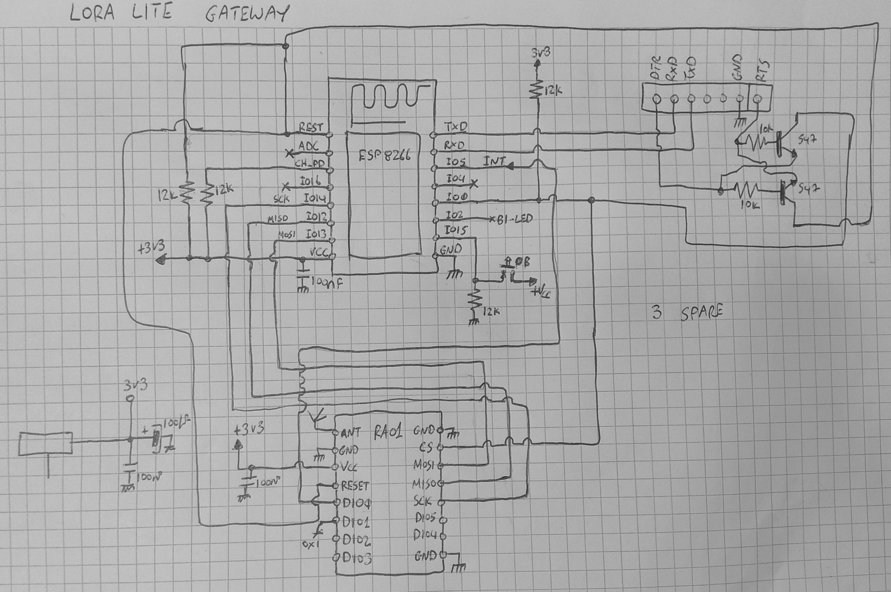

Η πύλη LoRa Wan Lite υποστηρίζει ένα μόνο κανάλι και στην αρχική της έκδοση λειτουργεί αμφίδρομα για κόμβους τάξης Α'. Κατόπιν οδηγίας από τον NW Server μπορεί να εκπέμψει (Download), στο παράθυρο RX1 ή στο RX2 με χαμηλότερο bit rate.

Όπως φαίνεται στο κύκλωμα ο επεξεργαστής ESP8266 επικοινωνεί με το άρθρωμα RA01 μέσω του διαύλου SPI. Ο προγραμματισμός και η εκσφαλμάτωση γίνεται από την σειριακή θύρα. Το ESP8266 επικοινωνεί με το τοπικό δίκτυο ή το διαδίκτυο μέσω του WiFi και του ενσωματωμένου TCP/IP stack. 
Η πύλη ακούει συνεχώς στη συχνότητα για εκπομπή από κάποιο κόμβο. Αν λάβει κάτι, χωρίς να αποκρυπτογραφήσει το payload, το ετοιμάζει σε πακέτο JSON και το προωθεί με πρωτόκολλο UDP στον NW Server μέσα από την σύνδεση WiFi. 
Ο NW Server λαμβάνει το πακέτο, το αποκρυπτογραφεί και στέλνει το μήνυμα στον MQTT broker. Παράλληλα ετοιμάζει πλαίσιο απάντησης προς τον κόμβο και το στέλνει στη πύλη μέσα της ίδιας σύνδεσης UDP. Το Download πλαίσιο μπορεί να είναι μόνο επιβεβαίωση για το πλαίσιο που μόλις έλαβε, αλλά μπορεί να περιέχει και οδηγίες προς τον κόμβο όπως για παράδειγμα να ανάψει την θέρμανση.  
Η πύλη αφού λάβει το πακέτο JSON από τον NW Server, εκπέμπει στο παράθυρο RX1 ή RX2 και ο παραλήπτης κόμβος δέχεται το πλαίσιο.
