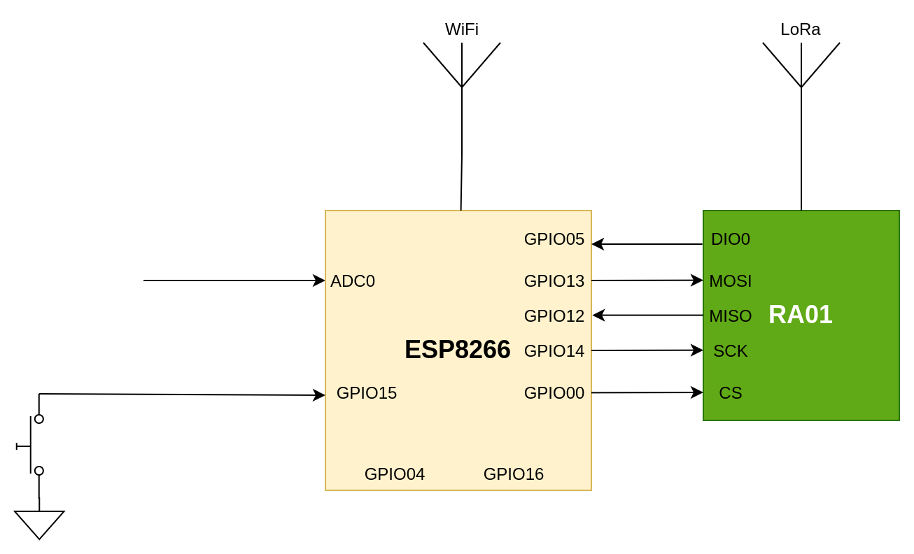

Η πύλη LoRa Wan Lite δέχεται πακέτα από τους κόμβους δηλαδή τα θερμοκήπια και τα προωθεί στον Network Server. Η επικοινωνία είναι αμφίδρομη γιατί η πύλη δέχεται πακέτα από τον Network Server και τα στέλνει στου κόμβους ώστε να κάνουν κάποια ενέργεια π.χ. πότισμα, εξαερισμό κλπ.

