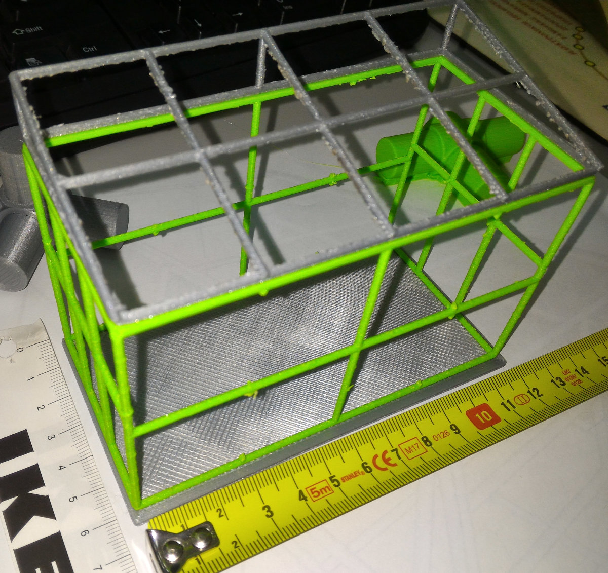
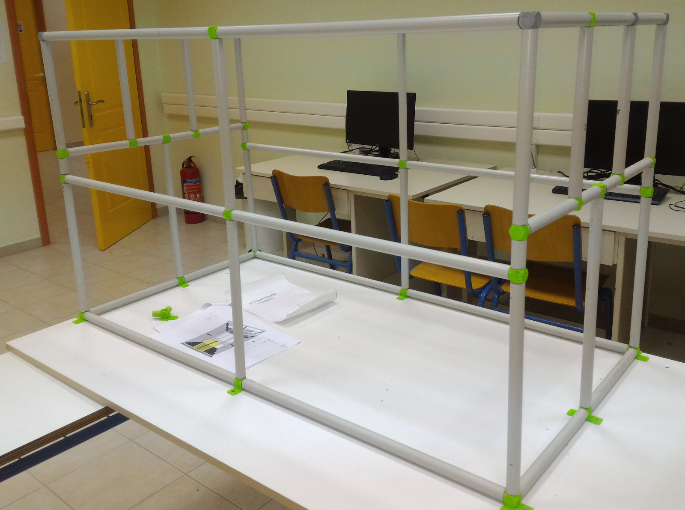
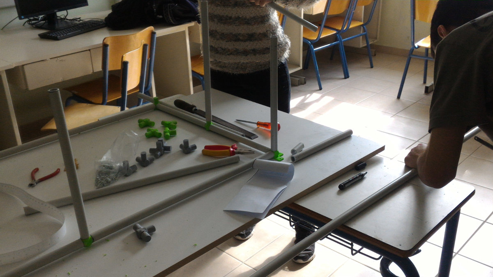
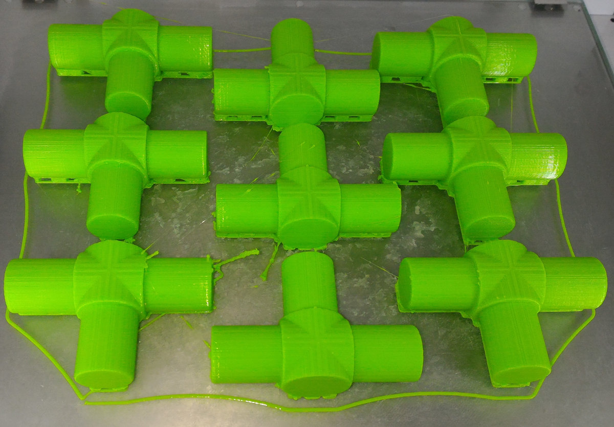
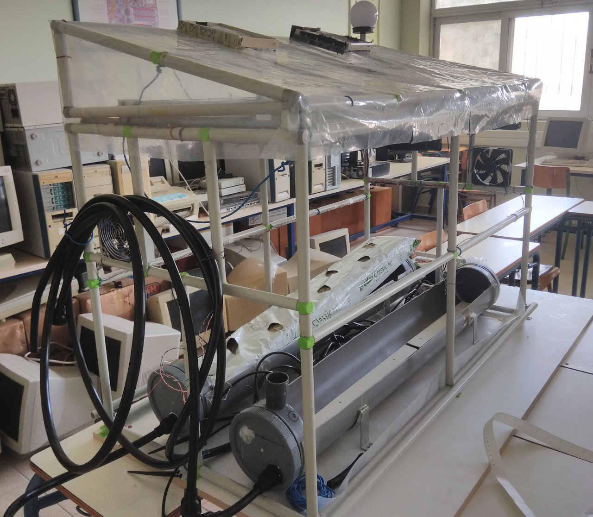
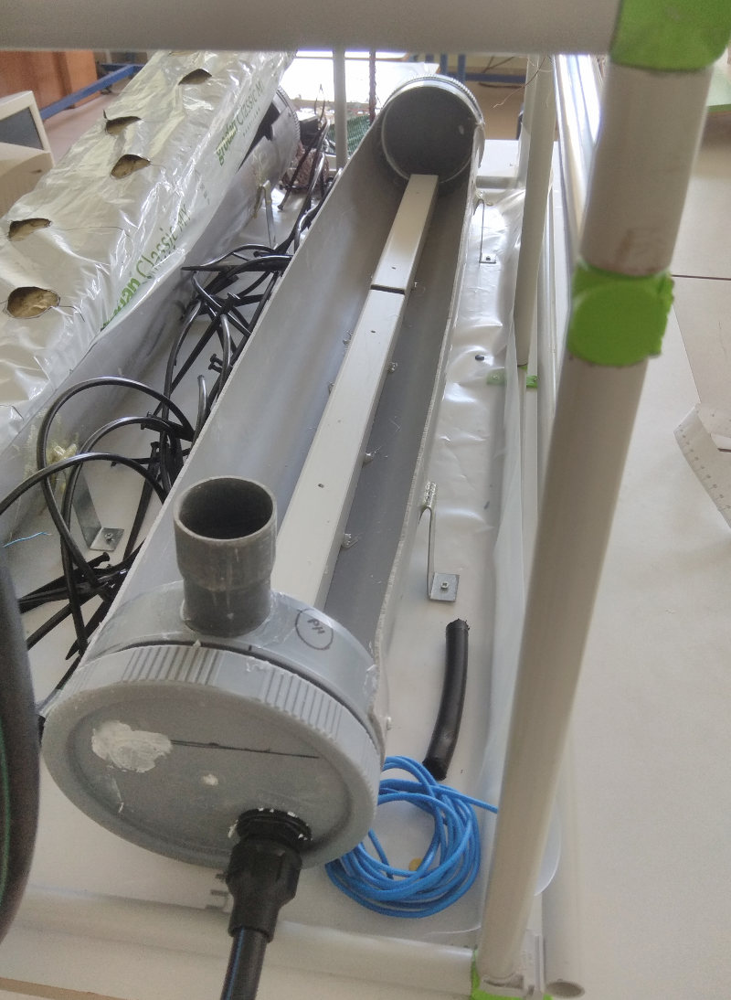

# ETHIC
Αποθετήριο με οδηγίες κατασκευής και πηγαίο κώδικα για το έργο " Έξυπνο Θερμοκήπιο Υδροπονικής Καλλιέργειας "
**Ομάδα:** ΚΟΤΣΑΝΙΑ Α.Ε.  
**Σχολείο:** 1ο ΕΠΑ.Λ. Πρέβεζας - 1ο Ε.Κ. Πρέβεζας (2019-20, 2020-21) 
**Τίτλος έργου:** Έξυπνο Θερμοκήπιο Υδροπονικής Καλλιέργειας (Ε.Θ.Υ.Κ.)  
 

Στάδια υλοποίησης του έργου
===========================
01/12/19 - 20/12/19 : <a href="en1.md">Αρχικός σχεδιασμός ιδέας</a> 
08/01/20 - 18/01/20 : <a href="en2.md">Σχεδιασμός Hardware</a> 
19/01/20 - 29/01/20 : Σχεδιασμός 3D εξαρτημάτων και εκτύπωση στον 3D printer 
23/01/20 - 30/01/20 : Μελέτη πρωτοκόλλου LoRa WAN και κατασκευή απλούστερου με ονομασία LoRa WAN Lite 
01/02/20 - 20/03/20 : Κατασκευή θερμοκηπίου - Παραγγελία υλικών 
..... Διακοπή λόγω της πανδημίας .... 
Απρίλιος '21 : Κατασκευή υδραυλικών - αρδευτικών συστημάτων. Δοκιμές άρδευσης
    -//-     : Κατασκευή συστήματος σκίασης. 
Μάϊος '21    : Πέρασμα καλωδίωσης - ηλεκτρολογική εγκατάσταση. 
    -//-     : Τοποθέτηση συστημάτων ποτίσματος - δοκιμές. 
    -//-     : Τοποθέτηση νάυλον. 
Ιούνιος '21  : Διόρθωση αρχικών σχεδίων. 
    -//-     : Κατασκευή πρωτότυπου ηλεκτρονικού κυκλώματος σε perfboard. 
    -//-     : Δοκιμές του πρωτοκόλλου LoRa WAN Lite.  
 

  
 
 
 
 
 

Περιγραφή έργου - Στόχοι
========================
Η ομάδα μας θα κατασκευάσει <b>μακέτα</b> σύγχρονου θερμοκηπίου υδροπονικής καλλιέργειας το οποίο θα ελέγχεται εξ' ολοκλήρου από Η/Υ. Το σύστημα εκτός από την δυνατότητα τηλεχειρισμού των λειτουργιών, θα έχει την δυνατότητα λήψης αποφάσεων ώστε να τηρούνται οι κατάλληλες συνθήκες για την σωστή ανάπτυξη των φυτών. Επιπλέον θα υπάρχει η δυνατότητα αποθήκευσης και γραφικής προβολής όλων των δεδομένων ώστε ο παραγωγός να μπορεί να συσχετίζει την εξέλιξη της παραγωγής σε συνάρτηση με τις συνθήκες του θερμοκηπίου. Έτσι θα μπορεί να δημιουργήσει μια βάση δεδομένων από την οποία θα αντλεί χρήσιμες πληροφορίες για το κάθε είδος ώστε να μεγιστοποιηθεί η παραγωγή.

Είμαστε μαθητές της Β' τάξης του τομέα πληροφορικής του 1ου ΕΠΑ.Λ. Πρέβεζας. Η υλοποίηση του έργου θα γίνει στα εργαστήρια του 1ου Ε.Κ. Πρέβεζας μετά την λήξη του διδακτικού ωραρίου.

Συμμετέχοντες μαθητές
=====================
<ul>
 <li>Θεοφάνους Ευαγγελία</li>
 <li>Λίτσι Θωμάς</li>
 <li>Μιχαηλίδης Γιώργος</li>
 <li>Νέσσερης Θοδωρής</li>
</ul>

Υπεύθυνος καθηγητής: Σταύρος Φώτογλου ΠΕ86 πληροφορικής

Εισαγωγή - Θεωρητικό υπόβαθρο
=============================

**Τι είναι η Υδροπονία;**

Η υδροπονία είναι η πλέον τεχνολογικά εξελιγμένη μέθοδος καλλιέργειας θερμοκηπιακών μονάδων, με αυξημένες απαιτήσεις σε επίπεδο εξοπλισμού  και γνώσεων του καλλιεργητή. Οι υδροπονικές καλλιέργειες εξασφαλίζουν υψηλές στρεμματικές αποδόσεις  κατά τη λειτουργία του θερμοκηπίου, μείωση κόστους παραγωγής και ανταγωνιστικά προϊόντα υψηλής και σταθερής ποιότητας.

**Πλεονεκτήματα της Υδροπονίας**

Με την Θερμοκηπιακή Υδροπονία μπορούμε να ελαχιστοποιήσουμε την εποχικότητα στην παραγωγή, και να εξασφαλίσουμε σταθερή και ποιοτική παραγωγή προϊόντων σε σταθερές και ελεγχόμενες συνθήκες. Η Θερμοκηπιακή Υδροπονία δεν έχει ανάγκη από χώμα και μπορεί να χρησιμοποιηθεί σε μέρη όπου η καλλιέργεια στο χώμα είναι αδύνατη (άγονα–πετρώδη εδάφη).
Επιτυγχάνει σημαντική εξοικονόμηση νερού, δεν μολύνει το περιβάλλον και δεν απαιτεί ζιζανιοκτόνα. 
Συγχρόνως πετυχαίνουμε αύξηση της παραγωγής από 3 έως 10 φορές περισσότερο από την παραδοσιακή καλλιέργεια.

Το μεγαλύτερο όφελος της υδροπονικής καλλιέργειας είναι η ριζική αντιμετώπιση των εδαφογενών ασθενειών. Η καλλιέργεια εκτός εδάφους καθιστά περιττή την απολύμανση του εδάφους με τη χρήση χημικών ουσιών. Συνεπώς οι καλλιέργειες εκτός εδάφους είναι απαλλαγμένες από την παρουσία παθογόνων στο ριζικό περιβάλλον, όταν πραγματοποιούνται είτε σε καθαρό θρεπτικό διάλυμα είτε σε υπόστρωμα που χρησιμοποιείται για πρώτη φορά. Ένα άλλο πλεονέκτημα των υδροπονικών καλλιεργειών είναι η μείωση του κόστους θέρμανσης λόγω της κάλυψης του εδάφους η οποία οδηγεί σε μειωμένη εξάτμιση νερού και συνεπώς στον περιορισμό της κατανάλωσης ενέργειας σε μορφή λανθάνουσας θερμότητας. Μειωμένο κόστος θέρμανσης προκύπτει επίσης και από το γεγονός ότι οι υδροπονικές καλλιέργειες δεν εξαρτώνται από τη θερμοκρασία του εδάφους του θερμοκηπίου. Ένα άλλο πλεονέκτημα είναι η σημαντική πρωίμιση της παραγωγής που οφείλεται κυρίως στις υψηλότερες θερμοκρασίες που μπορούν να διατηρηθούν στο περιβάλλον των ριζών.

**Συνοπτικά θα μπορούσαμε να πούμε ότι:**
1. Η Θερμοκηπιακή Υδροπονία αποτελεί μια άριστη εναλλακτική λύση αντιμετώπισης των προβλημάτων που προκαλούν οι μεταδιδόμενες μέσω του εδάφους ασθένειες (π.χ. φουζάριο, βερτιτσίλιο, πύθιο κ.τ.λ.), ενώ το ξεκίνημα της καλλιέργειας γίνεται με απουσία παθογόνων στο ριζικό περιβάλλον.

2. Απαλλαγή της φυτείας από την παρουσία ζιζανίων.

3. Λύνεται το πρόβλημα της χαμηλής γονιμότητας που εμφανίζουν πολλά εδάφη, είτε λόγω της υπερεντατικής τους εκμετάλλευσης και της μονοκαλλιέργειας, είτε λόγω δυσμενών φυσικών ιδιοτήτων (π.χ. εναλατωμένα εδάφη, πολύ βαριά εδάφη, εδάφη με πολύ χαμηλή περιεκτικότητα σε οργανική ουσία).

4. Έχει αποδειχθεί στην πράξη ότι η καλλιέργεια πάνω σε καλής ποιότητας υποστρώματα και σε καθαρό θρεπτικό διάλυμα επιφέρει σημαντική πρωίμιση της συγκομιδής. Αυτό οφείλεται στη δυνατότητα διατήρησης υψηλότερων θερμοκρασιών στον χώρο του ριζοστρώματος.

5. Η καλλιέργεια των φυτών εκτός εδάφους απαλλάσσει τον καλλιεργητή, αφενός, από τις εργασίες της προετοιμασίας του εδάφους (όργωμα, φρεζάρισμα, βασική λίπανση κ.τ.λ.), με αποτέλεσμα να μειώνονται οι ανάγκες σε εργατικά, και, αφετέρου, να είναι δυνατή η φύτευση νέας καλλιέργειας αμέσως μετά την απομάκρυνση της προηγούμενης.

6. Δίνει αυξημένες αποδόσεις λόγω της αύξησης της πυκνότητας φύτευσης, της άριστης θρέψης, της δυνατότητας διατήρησης υψηλότερων θερμοκρασιών στο ριζόστρωμα κατά τη διάρκεια της ψυχρής εποχής του έτους και των καλύτερων φυσικοχημικών ιδιοτήτων, που έχουν τα υποστρώματα έναντι του εδάφους.

7. Αυτοματοποίηση και μηχανοποίηση των καλλιεργητικών εργασιών.

Αρχικός Σχεδιασμός
==================

Θα κατασκευάσουμε μια μακέτα θερμοκηπίου από νάυλον διαστάσεων περίπου 100cm x 50cm x60cm. Μέσα θα τοποθετηθούν όλα τα εξαρτήματα και οι συσκευές που χρησιμοποιούνται σε ένα πραγματικό θερμοκήπιο. Συγκεκριμένα θα βάλουμε τα εξής:  
1.	Στοιχεία θέρμανσης του αέρα
2.	Αυτόματο πότισμα
3.  Εξαερισμό με ανεμιστήρες
4.  Σύστημα αυτόματης σκίασης
5.  Σύστημα ελέγχου των παραθύρων

Ένα πλήθος αισθητήρων θα τροφοδοτεί με δεδομένα τον κεντρικό Η/Υ ώστε να λαμβάνονται οι αποφάσεις για τον έλεγχο των παραπάνω συσκευών. Θα τοποθετήσουμε αισθητήρες:
1.  Θερμοκρασίας
2.  Ηλιοφάνειας
3.  PH
4.  Υγρασίας εδάφους
5.  Υγρασίας αέρα

Μέσα στο σπογγώδες υπόστρωμα θα φυτέψουμε φυτά ώστε να κάνουμε τις δοκιμές μας σε πραγματικές συνθήκες.

Επειδή το θερμοκήπιο μπορεί να είναι απομακρυσμένο και να μην υπάρχει δυνατότητα σύνδεσης με το διαδίκτυο (εκτός από δίκτυα 3G-4G-5G τα οποία έχουν και το ανάλογο κόστος χρήσης), θα χρησιμοποιήσουμε το σύστημα μετάδοσης LO.RA. για την επικοινωνία με τον 2ο χώρο π.χ. το σπίτι του παραγωγού, όπου θα υπάρχει σύνδεση με το διαδίκτυο. Το σύστημα LO.RA. μπορεί να καλύψει μεγάλες αποστάσεις (έως 30Km) για χαμηλούς ρυθμούς μετάδοσης. Επειδή το θερμοκήπιό μας δεν στέλνει και πολλά δεδομένα από τους αισθητήρες του, το πρωτόκολλο LORA WAN είναι ιδανικό. Σήμερα λειτουργούν αρκετά δίκτυα LORA WAN σε όλο τον κόσμο και χρησιμοποιούνται σε συστήματα IOT όταν είναι απομακρυσμένα και θέλουμε χαμηλή κατανάλωση ενέργειας.  

Όπως φαίνεται στο σχήμα στο θερμοκήπιο (Χώρος Β') υπάρχουν όλοι οι αισθητήρες και οι ενεργοποιητές οι οποίοι συνδέονται σ' ένα arduino. Επίσης στο arduino συνδέεται ένα άρθρωμα LORA το οποίο στέλνει τα δεδομένα και δέχεται εντολές από τον κεντρικό υπολογιστή ο οποίος βρίσκεται στον χώρο Α'. Ο κώδικας στο arduino θα γραφτεί σε Wiring. Τα δεδομένα είναι κωδικοποιημένα και κρυπτογραφημένα σύμφωνα με το πρωτόκολλο LORA WAN. 

Από την άλλη πλευρά (Χώρος Α΄), υπάρχει μια απλή πύλη LORA WAN η οποία στέλνει τα δεδομένα στο διαδίκτυο με το πρωτόκολλο MQTT. Στη πύλη μπορούν να συνδεθούν περισσότερα θερμοκήπια και να διαχειρίζονται από το ίδιο ή διαφορετικούς servers. Το λογισμικό της πύλης ενώ αρχικά το γράψαμε σε micropython, παρουσιάστηκαν προβλήματα καθυστέρησης και εδώ οι χρόνοι είναι κρίσιμοι. Έτσι το μεταφέραμε και αυτό σε wiring. 

Τέλος ο εξυπηρετητής μπορεί να είναι οποιοσδήποτε υπολογιστής με Linux, στον οποίο θα τρέχει το mosquitto (MQTT Broker) και το Node Red. Εδώ μπορούμε να προσθέσουμε και μερικά δικά μας script σε Python τα οποία θα ακούν ή θα δημοσιεύουν σε mqtt topics. Εμείς για εξυπηρετητή σκοπεύουμε να χρησιμοποιήσουμε ένα Raspberry PI 3 ή 4.

Το έργο μπορεί να χρησιμοποιηθεί ως εποπτικό μέσο για την διδασκαλία των τεχνολογιών IOT σε μαθητές των τομέων Πληροφορικής, Ηλεκτρονικής - Ηλεκτρολογίας καθώς και για την μελέτη σύγχρονων καλλιεργητικών μεθόδων από μαθητές του τομέα Γεωπονίας και Τροφίμων.
