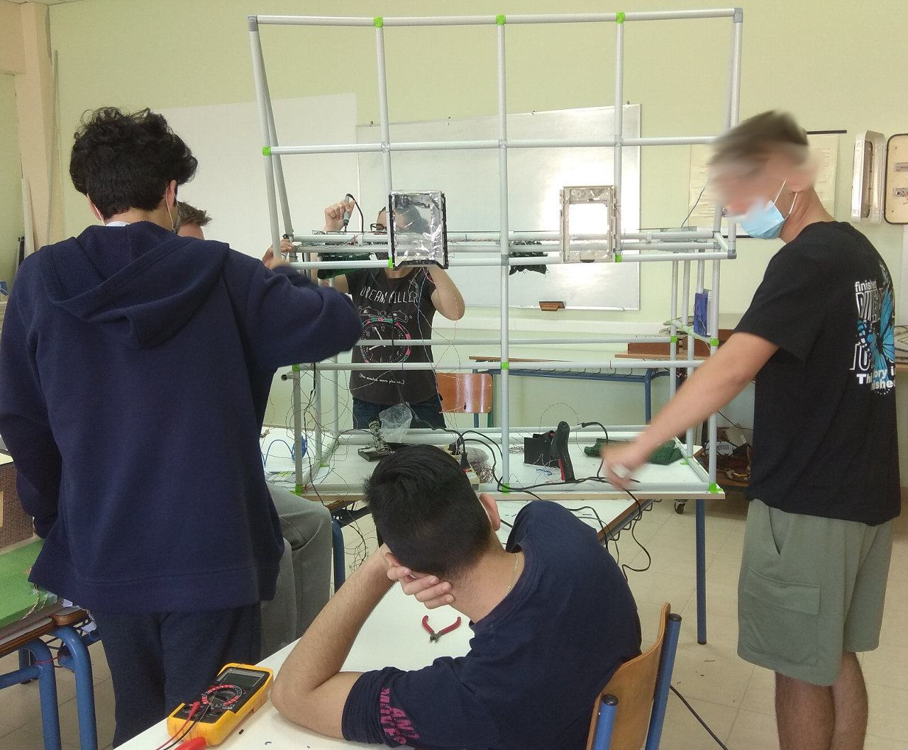
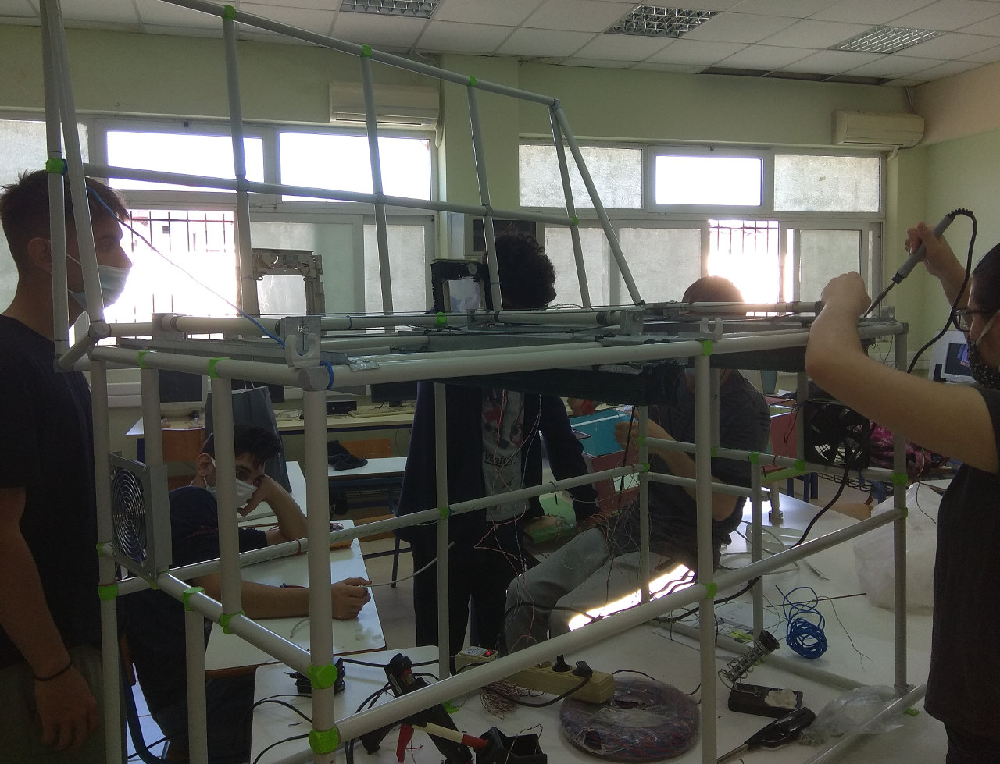
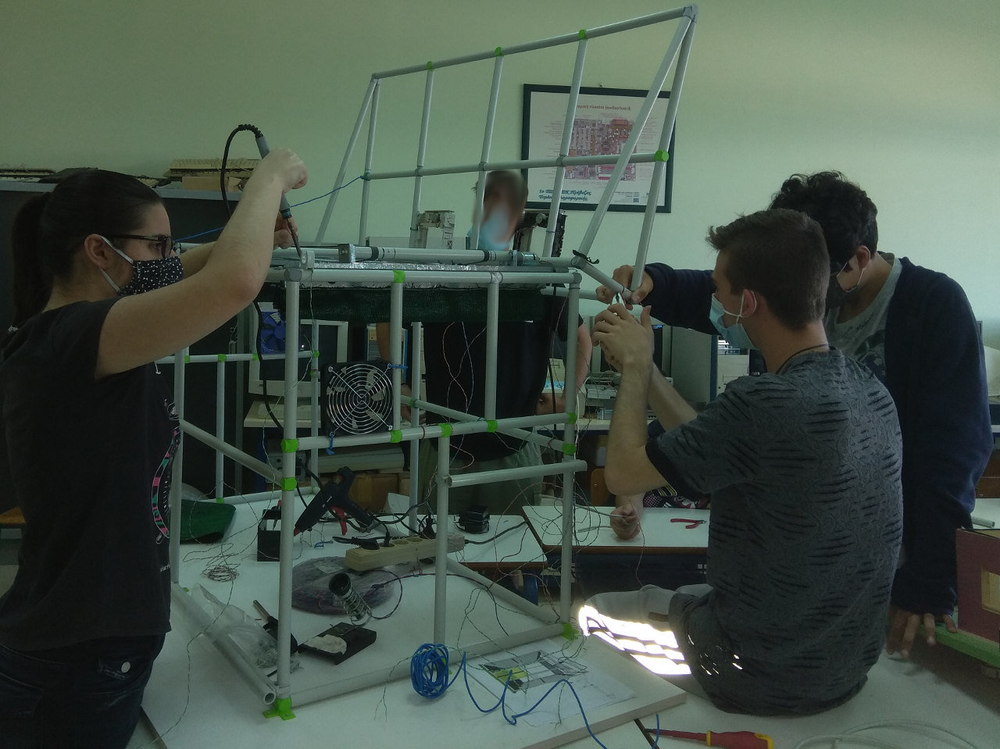
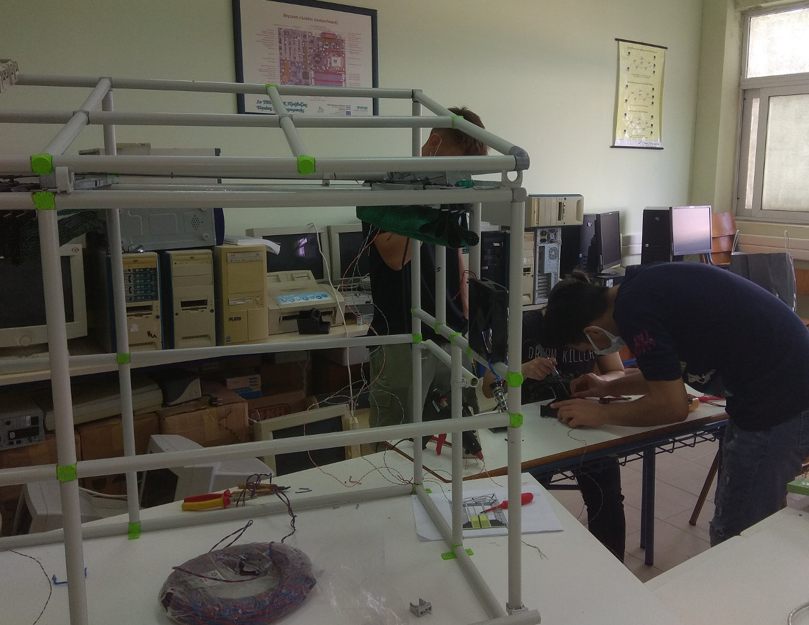
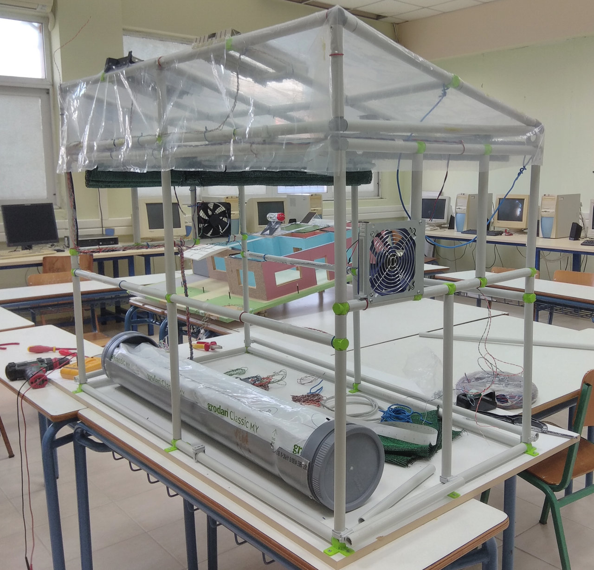
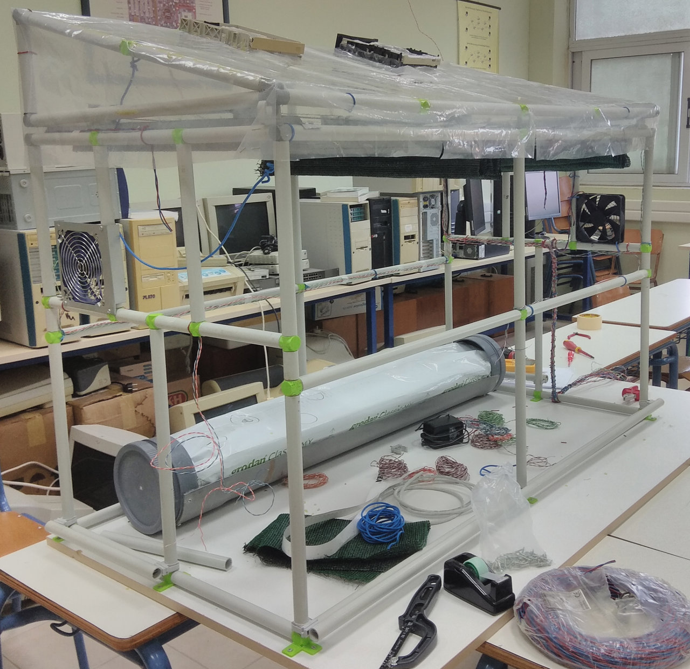

<a href="../README.md"><= Επιστροφή</a> 

Ακολούθησε η τοποθέτηση των συσκευών (αισθητήρων και ενεργοποιητών) και έγινε η ηλεκτρολογική εγκατάσταση.

  

  

  

  

Μετά τοποθετήσαμε το νάιλον της οροφής. Η οροφή είναι ανοιγόμενη ώστε να είναι ευκολότερη η πρόσβαση στο εσωτερικό του θερμοκηπίου. Τα πλαϊνά νάιλον θα τοποθετηθούν όταν τελειώσουν όλες οι εργασίες.

  

  

  <a href="../README.md"><= Επιστροφή</a> 
