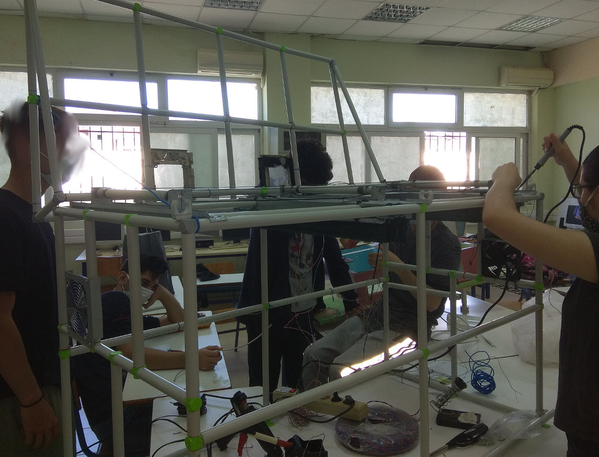

<a href="../README.md"><= Επιστροφή</a> 

Ακολούθησε η τοποθέτηση των συσκευών (αισθητήρων και ενεργοποιητών) και έγινε η ηλεκτρολογική εγκατάσταση.

  

  

  

  

  <a href="../README.md"><= Επιστροφή</a> 
