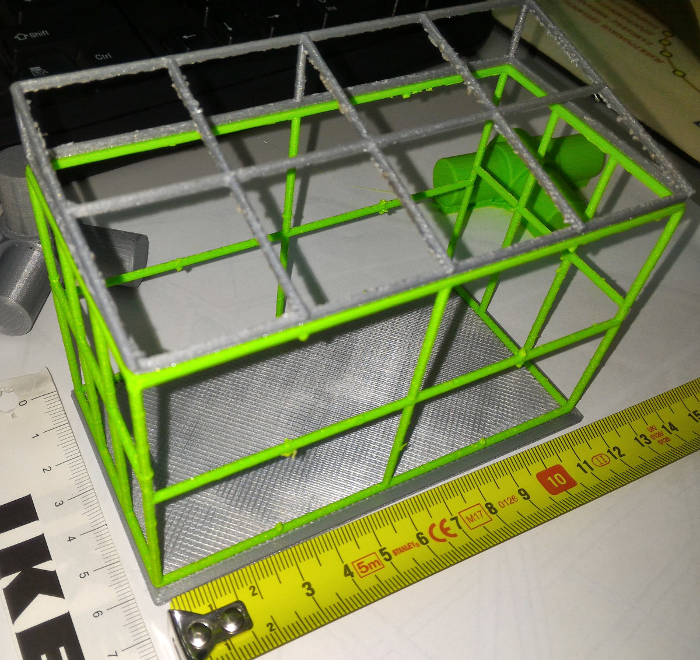
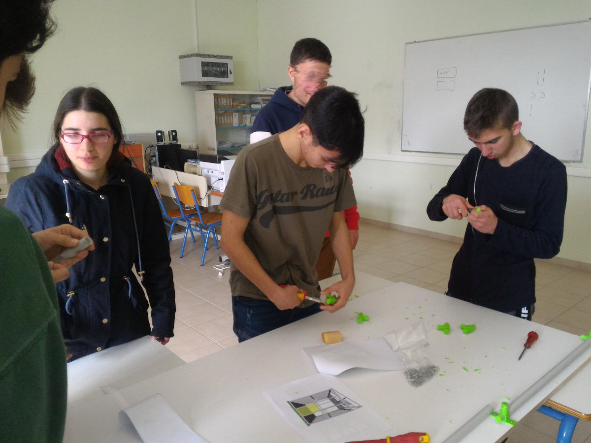
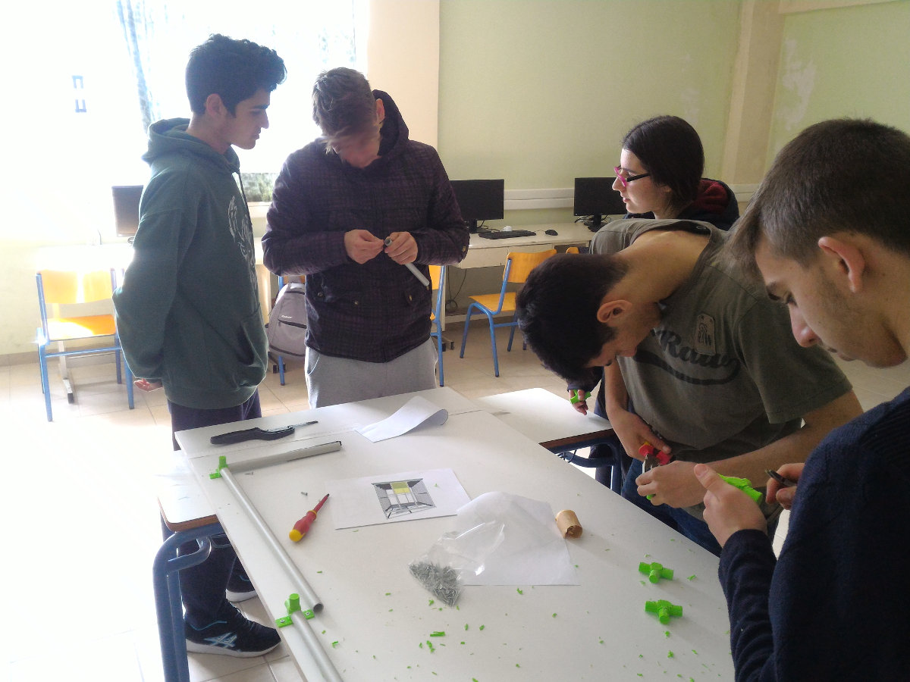
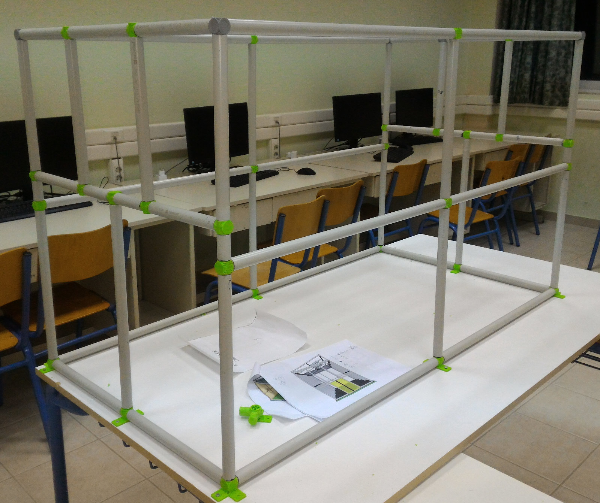
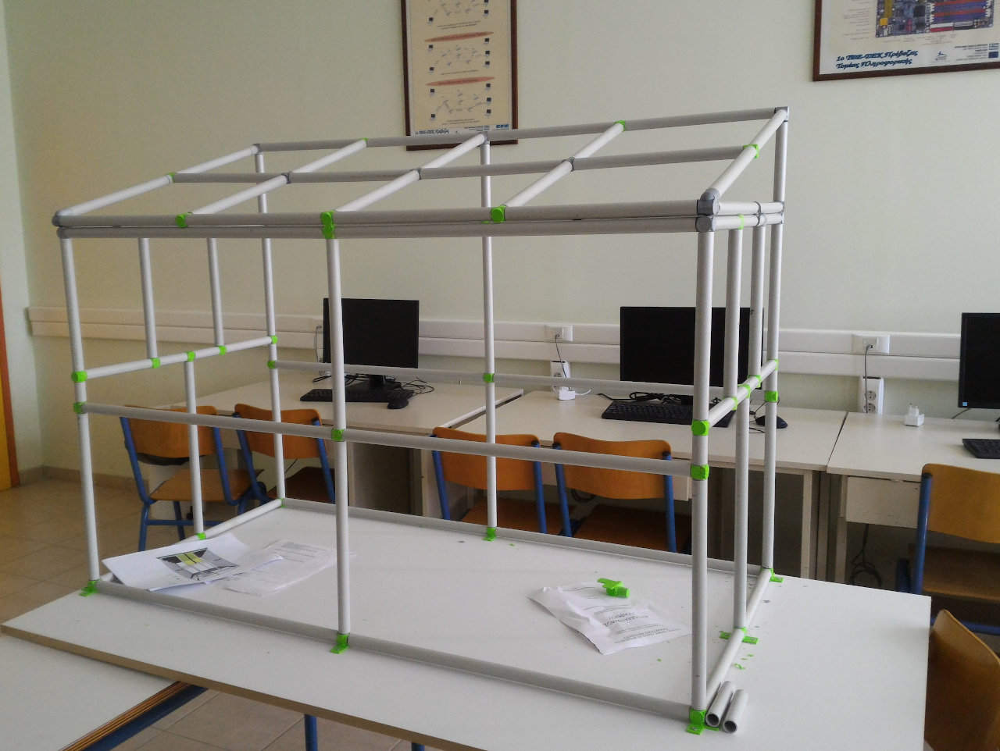

<a href="../README.md"><= Επιστροφή</a> 

Αρχικά σχεδιάσαμε στο λογισμικό ανοιχτού κώδικα FreeCad την μακέτα και εκτυπώσαμε τον σκελετό σε κλίμακα 1:10, ώστε να έχουμε μια εικόνα πριν την έναρξη της κατασκευής. Όλα τα αρχεία για την κατασκευή των εξαρτημάτων <a href="../CAD">βρίσκονται εδώ</a>.

  

Μετά σχεδιάσαμε τα εξαρτήματα των συνδέσμων στο FreeCad και τα εκτυπώσαμε στον εκτυπωτή 3D του σχολείου μας.

  

  

  

Ακολουθεί video:

  

Και μετά συναρμολογήσαμε τον σκελετό της μακέτας.

  

  

  

  

  

  

  

Ακολουθεί video:

  

  <a href="../README.md"><= Επιστροφή</a> 
