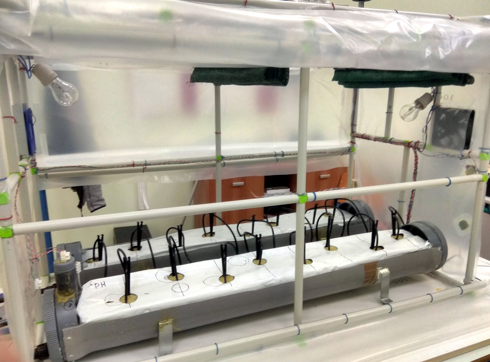

<a href="../README.md"><= Επιστροφή</a> 

Για θέρμανση χρησιμοποιήσαμε δύο λάμπες πυρακτώσεως των 100W η κάθε μία. Προσοχή οι λάμπες λειτουργούν με 220V. Όταν η εξωτερική θερμοκρασία είναι κάτω από 5°C και η εσωτερική έχει κατέβει κάτω από την ελάχιστη θερμοκρασία ανοχής της καλλιέργειας τότε αυτόματα το Arduino δίνει εντολή και ανάβει τις λάμπες. Φυσικά τα παράθυρα της οροφής είναι κλειστά. Επιπλέον αν δεν υπάρχει ηλιοφάνεια, το σύστημα απλώνει τις κουρτίνες ώστε να μειωθεί ο όγκος του χώρου και να μη χάνουμε θερμότητα από την οροφή.

  

  <a href="../README.md"><= Επιστροφή</a> 
