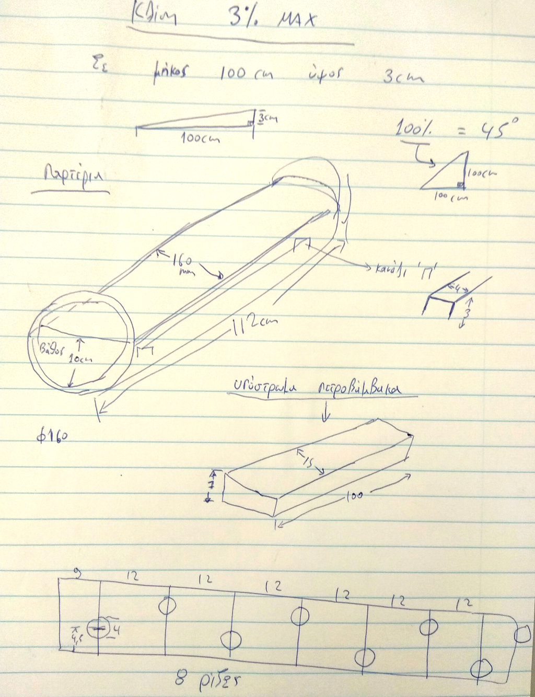
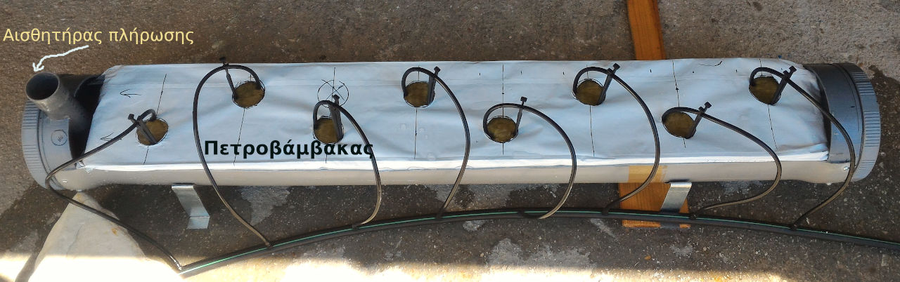
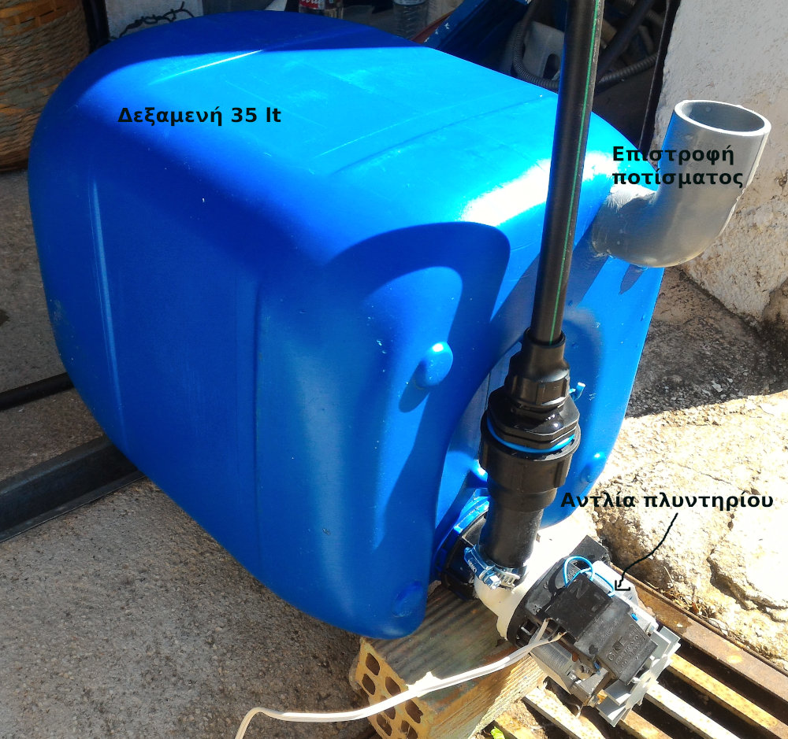

<a href="../README.md"><= Επιστροφή</a> 

Τα φυτά μας μεγαλώνουν σε υπόστρωμα πετροβάμβακα το οποίο είναι αδρανές υλικό. Με μικρά ακροφίσια (beck), τροφοδοτούμε τις ρίζες με νερό, μέσα στο οποίο είναι διαλυμένες οι θρεπτικές ουσίες τις οποίες τις εισάγουμε με λιπάσματα. Από κάτω, στο νάιλον το οποίο περιβάλει τον πετροβάμβακα, έχουμε κάνει οπές ώστε το περίσευμα νερού να πέφτει στο παρτέρι.

  

Όπως φαίνεται στο παραπάνω σκαρίφημα, τα παρτέρια είναι κατασκευασμένα από σωλήνα αποχέτευσης PVC Φ160 κομμένη εγκάρσια στα 3/5 της διαμέτρου. Στο δάπεδο υπάρχει ηλεκτρολογικό κανάλι το οποίο στηρίζει το υπόστρωμα ώστε να μην παραμορφωθεί από το βάρος όταν βραχεί και επιπλέον να γίνεται και αποστράγγιση του νερού. Στα παρτέρια δίνεται μέγιστη κλίση 3% ώστε αν το νερό ξεπεράσει την στάθμη να μπορεί να επιστρέψει πίσω στη δεξαμενή.

  

Η δεξαμενή με το θρεπτικό διάλυμα τοποθετείται χαμηλότερα από την μακέτα και με μια αντλία στέλνει το νερό στις ρίζες των φυτών.

  

  <a href="../README.md"><= Επιστροφή</a> 
