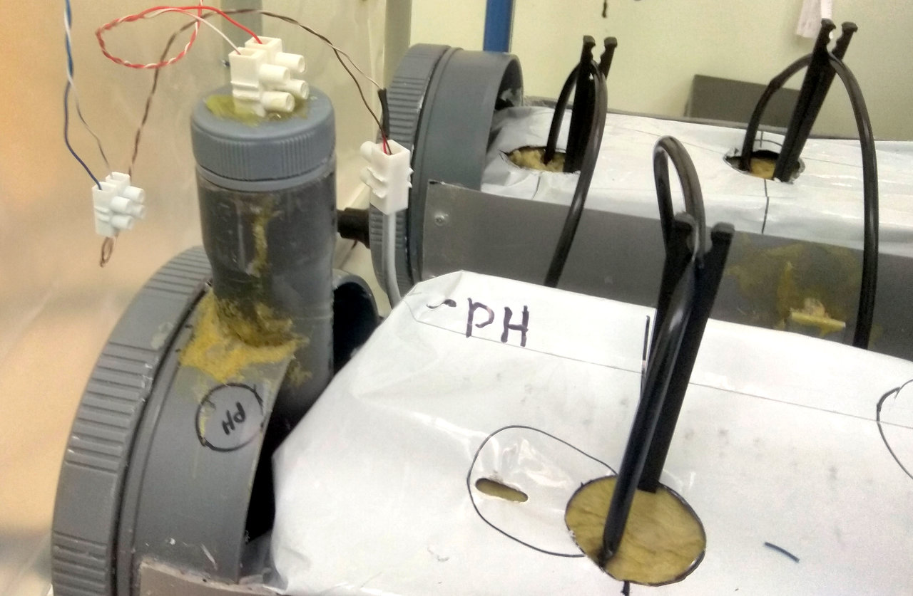

<a href="../README.md"><= Επιστροφή</a> 

Παρακάτω φαίνονται οι αισθητήρες του θερμοκηπίου. Για την εξωτερική θερμοκρασία χρησιμοποιήσαμε ένα θερμόμετρο OneWire με ακρίβεια 0,5°C. Για την εσωτερική θερμοκρασία και υγρασία βάλαμε το DHT22. Για την ένταση της ηλιακής ακτινοβολίας Irradiation βάλαμε ένα φτηνό φωτοβολταϊκό από φώτα κήπου. Αυτό σε φορτίο 100Ω παράγει τάση 2V περίπου. Για την πλήρωση της στάθμης ποτίσματος βάλαμε δύο μεταλλικά probe τα οποία μόλις έρθουν και τα δύο σε επαφή με νερό ενημερώνουν τον μικροελεγκτή. Τέλος για μετρητή pH βάλαμε ένα probe από ένα φτηνό όργανο γλάστρας αξίας περίπου 10€. Αυτό έχει μικρή ακρίβεια και μετράει τιμές από 2 (όξινο) έως 12 (αλκαλικό ή βασικό), αλλά για τον σκοπό του έργου μας είναι αρκετό. Το probe του Ph καρφώνεται οριζόντια στο υπόστρωμα του πετροβάμβακα ώστε να μετράει συνέχεια το Ph που υπάρχει στις ρίζες του φυτού. Κάθε καλλιέργεια χρειάζεται τροφή με διαφορετικό Ph ώστε να έχουμε την μέγιστη απόδοση.

  

  
Στην επόμενη εικόνα φαίνονται οι αισθητήρες πλήρωσης και Ph και ο τρόπος που τοποθετούνται. 

  

  <a href="../README.md"><= Επιστροφή</a> 
