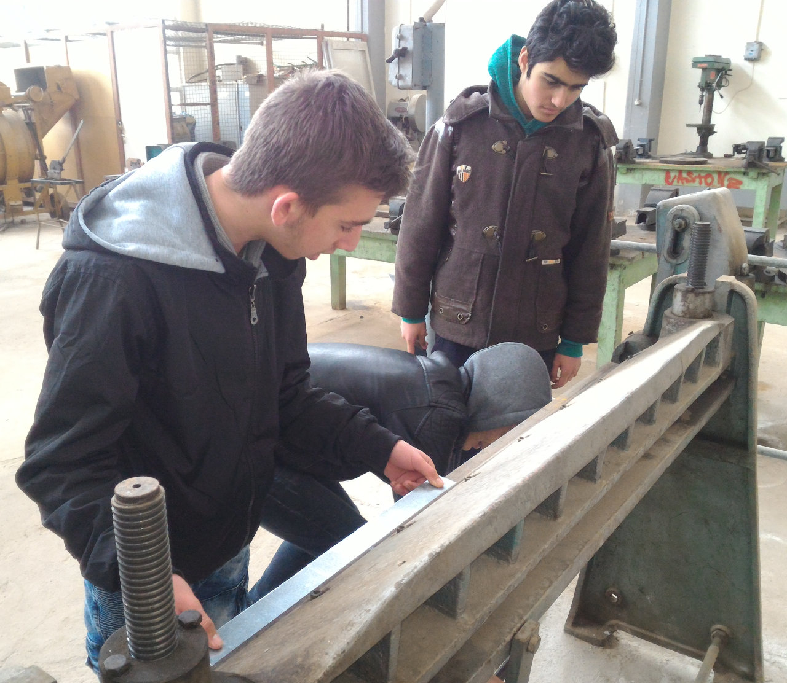
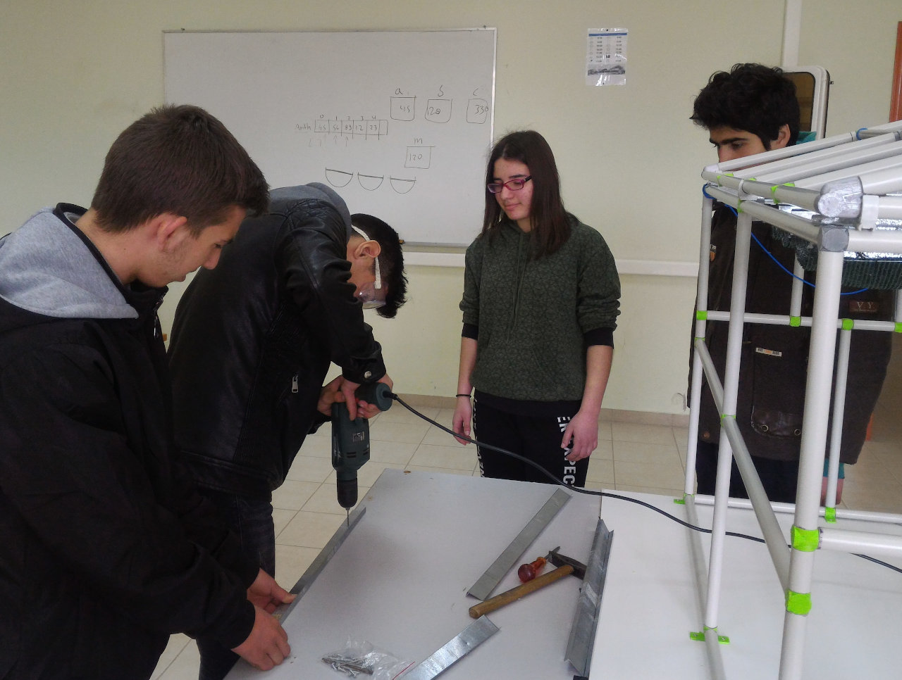
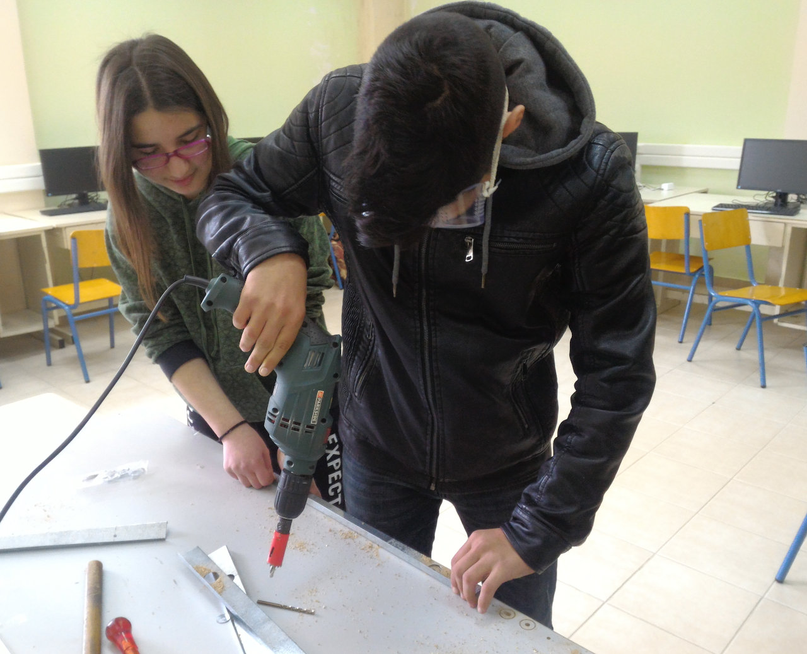
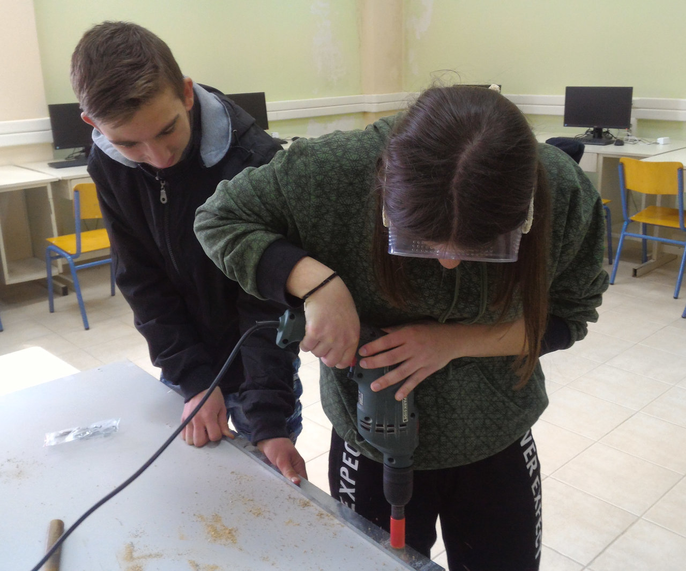

<a href="../README.md"><= Επιστροφή</a> 

Το σύστημα σκίασης αποτελείται από δύο κουρτίνες μήκους 60cm έκαστη. Είναι κατασκευασμένο από λαμαρίνα και ηλεκτρολογικούς σωλήνες PVC. Οι σωλήνες λειτουργούν ως οδηγοί στους οποίους κινούνται οι κουρτίνες. Η κίνηση δίνεται από ένα κινητήρα DC 12V με μειωτήρες και μεταδίδεται από ένα σύστημα ιμάντων οι οποίοι έχουν φτιαχτεί από σαμπρέλα ποδηλάτου. Στο πρώτο τμήμα υπάρχουν δύο τερματικοί διακόπτες οι οποίοι ειδοποιούν το Arduino αν η κουρτίνες είναι απλωμένες ή μαζεμένες ώστε να σταματάει την περιστροφή του κινητήρα.

  

Αρχικά στραντζάραμε την λαμαρίνα στη στράντζα του μηχανουργείου και μετά κάναμε οπές για να περάσουν οι οδηγοί.

  

  

  

  

Ακολουθεί video:

  

Video με τις δοκιμές λειτουργίας της σκίασης:

  

  <a href="../README.md"><= Επιστροφή</a> 
