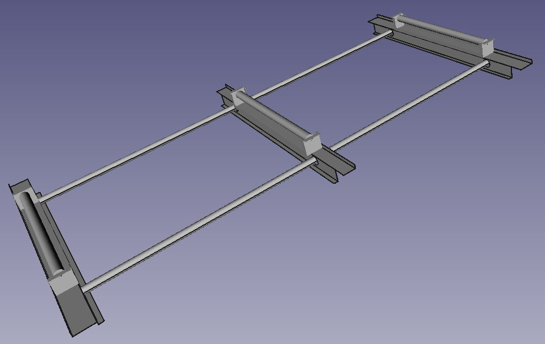

<a href="../README.md"><= Επιστροφή</a> 

Το σύστημα σκίασης αποτελείται από δύο κουρτίνες μήκους 60cm έκαστη. Είναι κατασκευασμένο από λαμαρίνα και ηλεκτρολογικούς σωλήνες PVC. Οι σωλήνες λειτουργούν ως οδηγοί στους οποίους κινούνται οι κουρτίνες. Η κίνηση δίνεται από ένα κινητήρα DC 12V με μειωτήρες και μεταδίδεται από ένα σύστημα ιμάντων οι οποίοι έχουν φτιαχτεί από σαμπρέλα ποδηλάτου.

  

Ακολουθεί video με τις δοκιμές ποτίσματος:

  

  <a href="../README.md"><= Επιστροφή</a> 
