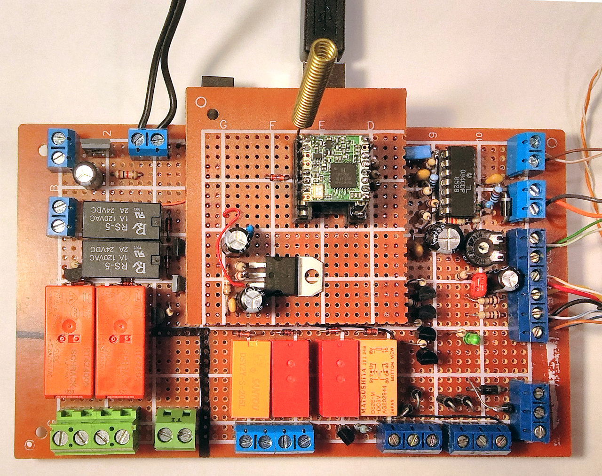
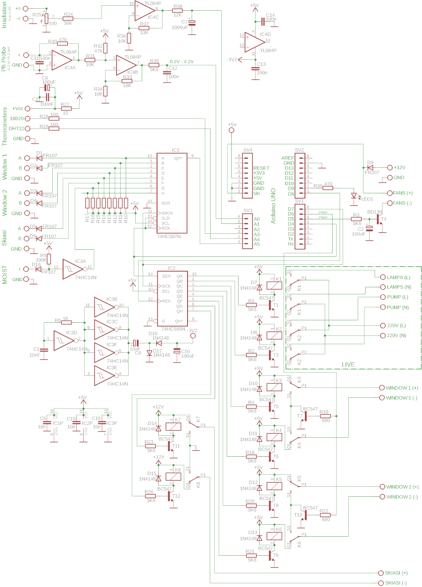
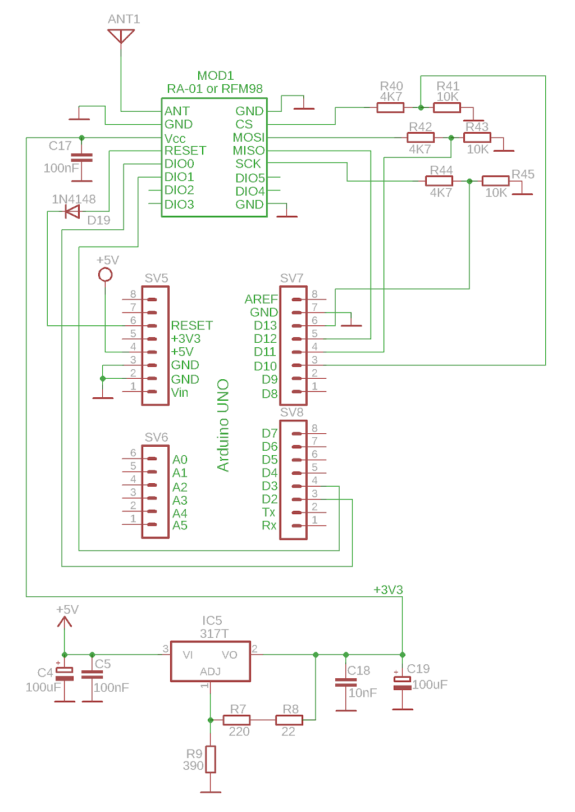

<a href="../README.md"><= Επιστροφή</a> 

Ο ελεγκτής του θερμοκηπίου είναι κατασκευασμένος με το Arduino UNO και πάνω σ' αυτό μπαίνουν δύο πρωτότυπες κάρτες επέκτασης συναρμολογημένες σε perfboard. Η πρώτη και μεγαλύτερη έχει όλα τα εξαρτήματα για την διασύνδεση των αισθητήρων και ενεργοποιητών του θερμοκηπίου. Από πάνω υπάρχει ο πομποδέκτης LoRa για την επικοινωνία με την πύλη LoRa WAN Lite.

  

Παρακάτω φαίνονται τα θεωρητικά κυκλώματα των δύο πλακετών.

  

  

  <a href="../README.md"><= Επιστροφή</a> 

