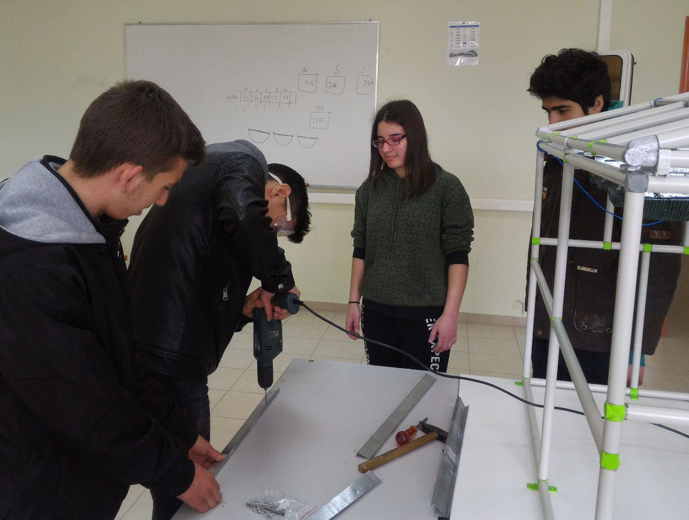
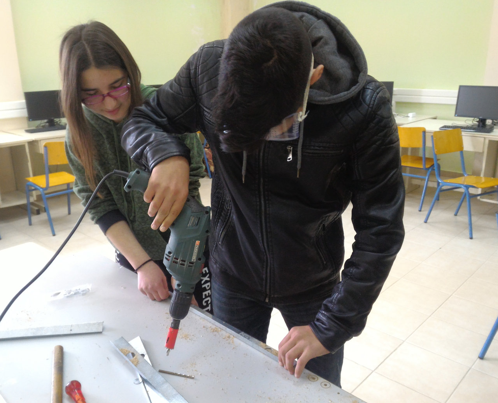
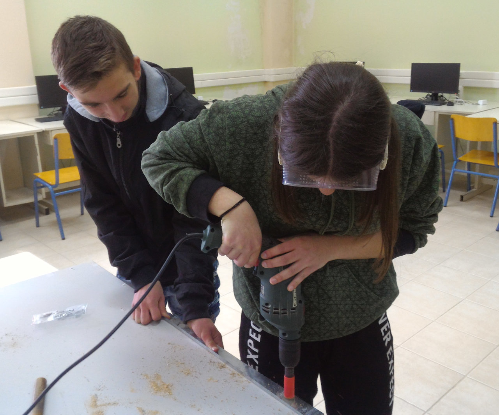

<a href="../README.md"><= Επιστροφή</a> 

Ο ελεγκτής του θερμοκηπίου είναι κατασκευασμένος με το Arduino UNO και πάνω σ' αυτό μπαίνουν δύο πρωτότυπες κάρτες επέκτασης συναρμολογημένες σε perfboard. Η πρώτη και μεγαλύτερη έχει όλα τα εξαρτήματα για την διασύνδεση των αισθητήρων και ενεργοποιητών του θερμοκηπίου. Από πάνω υπάρχει ο πομποδέκτης LoRa για την επικοινωνία με την πύλη LoRa WAN Lite.

  

Αρχικά στραντζάραμε την λαμαρίνα στη στράντζα του μηχανουργείου και μετά κάναμε οπές για να περάσουν οι οδηγοί.

  

  

  

  

Ακολουθεί video:

  

Video με τις δοκιμές λειτουργίας της σκίασης:

  

  <a href="../README.md"><= Επιστροφή</a> 

